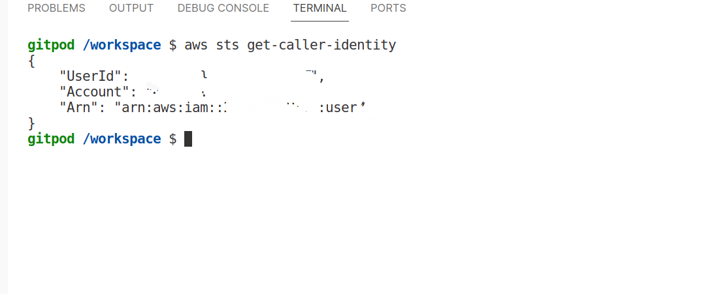
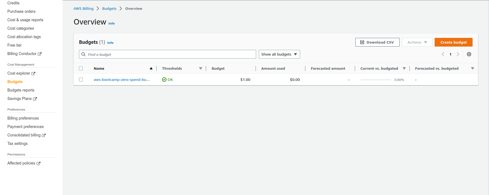
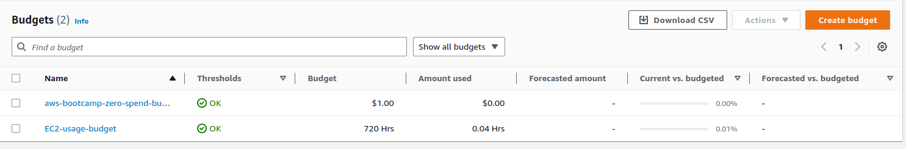
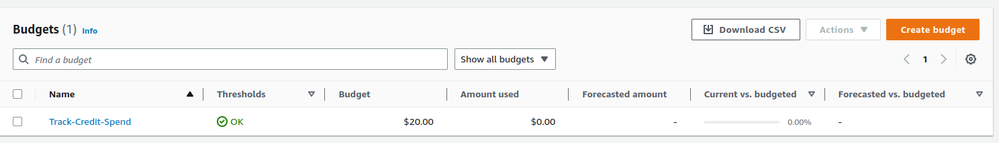
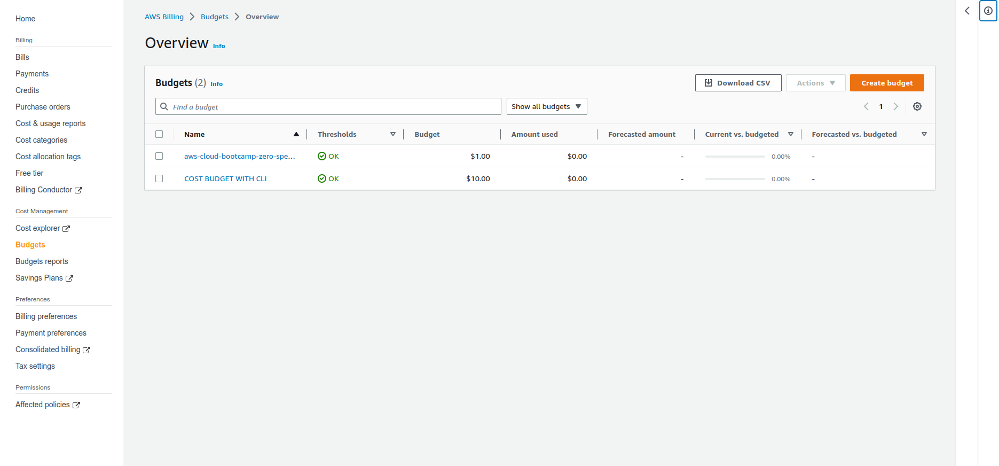
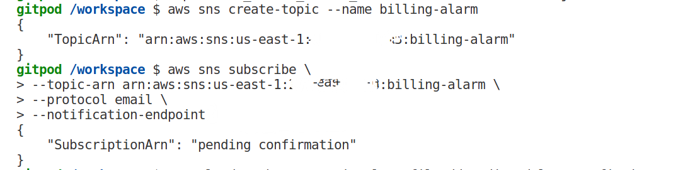
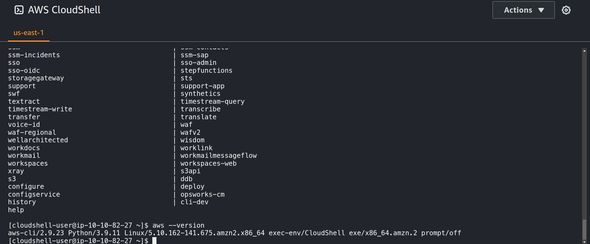
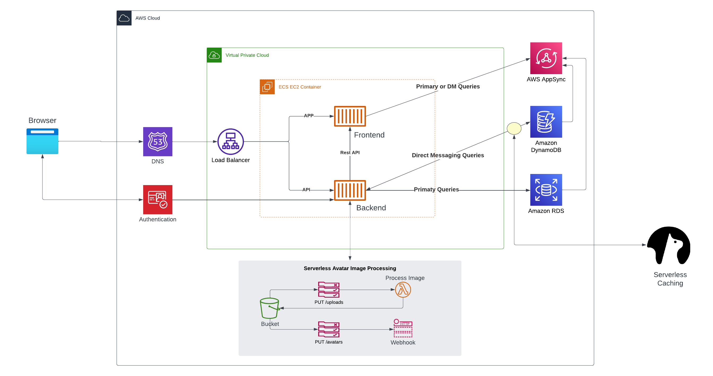
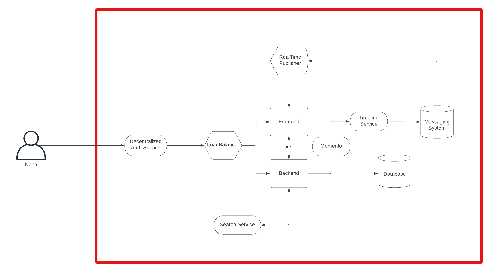

# Week 0 — Billing and Architecture

## Required Homework/Tasks

### Create Admin account

I logged in to the AWS Management Console and opened the IAM console. From there, I created a new user with programmatic access and attached the "AdministratorAccess" policy to grant the user full administrative access to AWS services.


### Generate AWS credentials
I generated AWS credentials on my admin account using the AWS Management Console. These credentials will allow me to verify the aws cli to use to provision resources in subsequent tasks.

Here are the steps I followed to generate the credentials:

1. I logged in to the AWS Management Console using my admin account credentials.
2. From the navigation menu, I selected "IAM" to open the Identity and Access Management console.
3. In the IAM console, I selected "Users" from the left-hand menu and then selected my admin user from the list of users.
4. On the user details page, I selected the "Security credentials" tab.
5. Under the "Access keys" section, I selected the "Create access key" button.
6. I copied the access key ID and secret access key values that were generated and stored them in a secure location for future use.
I made sure to deactivate the credentials when they aren't in use to bolster security

### Install and Verify AWS CLI
I successfully installed the AWS CLI within my Gitpod. I followed the instructions provided in the course content and did not encounter any issues.

To install the AWS CLI I run the following commands

1. I downloaded the installation package
```bash
curl "https://awscli.amazonaws.com/awscli-exe-linux-x86_64.zip" -o awscliv2.zip
```

2. I was able to extract the package and run the install script
```bash
$ unzip awscliv2.zip
$ sudo ./aws/install
```

3. I linked my pre generated aws credentials to the aws cli within gitpod
	

### Create a Budget
Today, I created several AWS budgets using both the AWS CLI and the AWS Management Console. I created a zero spend budget, an budget to track my ec2 usage, a credit spend tracker and cost budget using the aws console within gitpod. I made sure to not have more that 2 budgets active at a time so as to not incur additional charges.

- Zero spend budget. 
	

- EC2 usage budget


- Credit Spend Tracker


- Cost budget using AWS CLI


### Create a billing alarm
I created a billing alarm in AWS using the AWS CLI in Gitpod. I followed the video instructions provided in the course content and created an SNS topic, subscribed to the topic, and then created a CloudWatch alarm with the AWS CLI. The JSON files used for this process are located in the "aws/json" folder in my GitHub repository.

- Creation of sns topic and subscription
	

### Use CloudShell
I used AWS CloudShell to run AWS CLI commands. AWS CloudShell is a browser-based shell that provides me with on-demand access to pre-configured AWS CLI environments, making it easy to manage my AWS resources and services. I opened AWS CloudShell from the AWS Management Console and ran a few commands to test its functionality. However, I did not run the command `aws sts get-caller-identity` as it would have returned my AWS account ID, which I did not want to share.



### Recreate Logical Architectural design
I recreated the Logical diagram using LucidChart, which you can view here: [link to logical architectural design](https://lucid.app/lucidchart/4eb99b1a-e2a6-4ef0-933e-91ce8e83fc3b/edit?viewport_loc=-1762%2C344%2C3232%2C1616%2C0_0&invitationId=inv_49d09a13-159d-425a-b24a-cf82a47c45b2)


### Recreate Conceptual Architectural design
I recreated the Conceptual Diagram using LucidChart, which you can view here: [link to conceptual design](https://lucid.app/lucidchart/f26c459e-37fd-44cd-a3e1-f47a5e64cfe8/edit?viewport_loc=-791%2C-140%2C2240%2C1120%2C0_0&invitationId=inv_9afc855c-1c7a-4132-af90-ad2883baa7d3)


